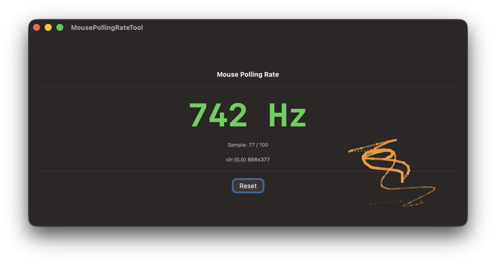

# MousePollingRateTool


マウスのポーリングレートを計測し、マウスカーソルの軌跡をリアルタイムで表示するmacOSアプリです。

## スクリーンショット



## 機能

- **ポーリングレート計測**：IOHIDManagerを使用してマウスのX軸イベントを直接取得し、高精度にポーリングレートを計測します
- **軌跡表示**：マウスカーソルの直近1.5秒間の軌跡を点で表示します
- **補完描画**：画面リフレッシュ間（約16ms）に発生したX軸イベント数を元に、前後のNSEvent座標間を等間隔に補完して滑らかな軌跡を描画します

## 動作環境

- macOS 14.0 (Sonoma) 以降
- Apple Silicon / Intel Mac

## インストール

### ビルド済みアプリを使用する場合

リポジトリに含まれる `MousePollingRateTool.app` をApplicationsフォルダにコピーしてください。

```
cp -R MousePollingRateTool.app /Applications/
```

### ソースからビルドする場合

1. Xcodeでプロジェクトを開きます

```
open MousePollingRateTool.xcodeproj
```

2. `⌘+R` でビルド・実行します

## 使い方

1. アプリを起動します
2. **入力監視の許可**を求めるダイアログが表示された場合は「システム設定を開く」をクリックし、システム設定 → プライバシーとセキュリティ → 入力監視 でアプリを許可してください
3. マウスを動かすと自動的に計測が開始されます
4. **100サンプル**収集されると自動的にポーリングレートが更新されます
5. 「Reset」ボタンで計測をリセットできます

## 権限について

このアプリはマウスの生のHIDイベントを取得するために **入力監視（Listen Events）** の権限が必要です。

- システム設定 → プライバシーとセキュリティ → 入力監視
- MousePollingRateTool をオンにしてください

権限が付与されていない場合、アプリ起動時にシステム設定へ誘導するダイアログが表示されます。

## 技術仕様

### ポーリングレート計測

`IOHIDManager` を使用してマウスのX軸（`kHIDUsage_GD_X`）イベントを監視します。連続するイベント間の時間間隔の平均から1秒あたりのイベント数（Hz）を算出します。

### 軌跡の補完アルゴリズム

macOSの `NSEvent.mouseLocation` は画面のリフレッシュレート（60Hz等）でしか更新されません。そのため以下の方法で補完しています。

```
リフレッシュA: NSEvent座標Aを記録、X軸イベントカウントをリセット
              ↓
  X軸イベント × n回発生（IOHIDで検知、座標は使わない）
              ↓
リフレッシュB: NSEvent座標Bを取得
              A→B間をn等分（ratio = 1/n, 2/n, ..., n/n）
              → n点を等間隔に生成してtrailPointsに追加
              ↓
次サイクル: BをAとして繰り返す
```

X軸イベントの座標値は一切使用せず、**イベントの発生回数のみ**を補完の点数に使用します。

### 座標変換

`NSEvent.mouseLocation`（スクリーン座標・左下原点）を `NSWindow.contentLayoutRect` を使ってCanvas座標（左上原点）に変換します。

## ライセンス

MIT License
