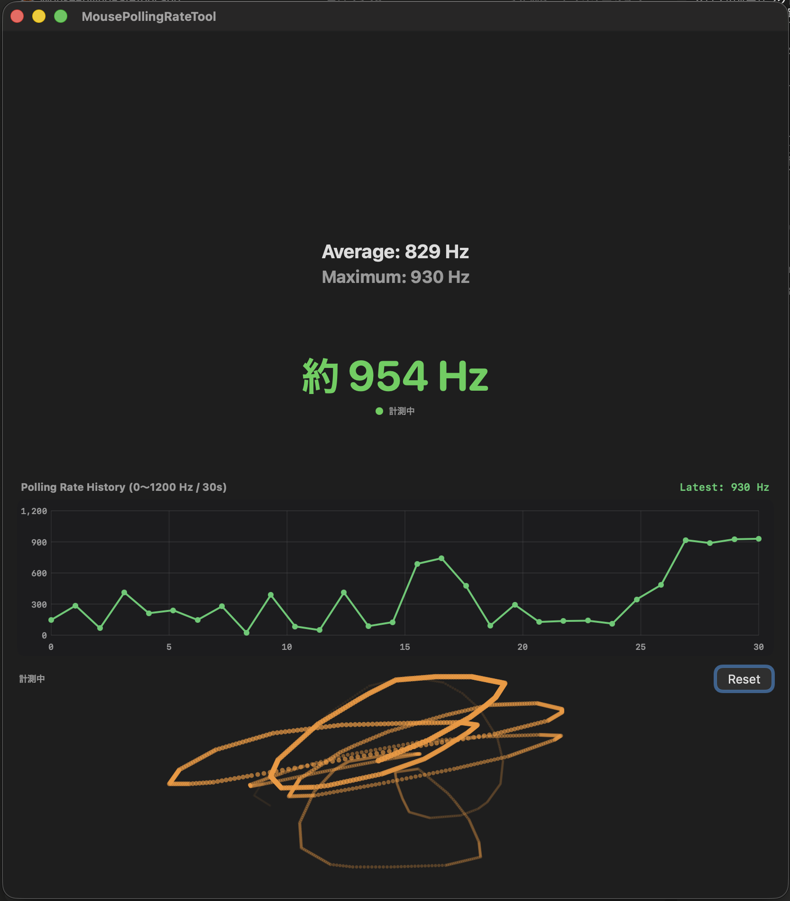
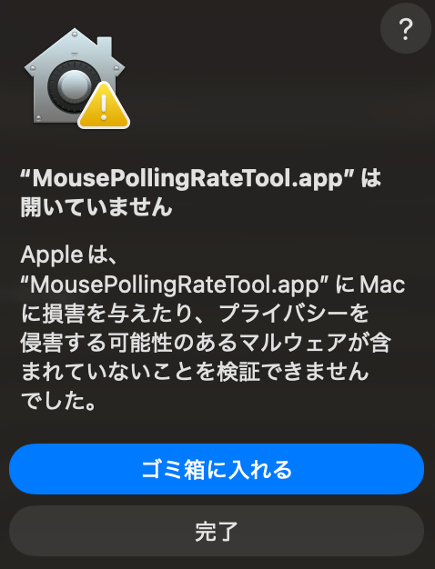
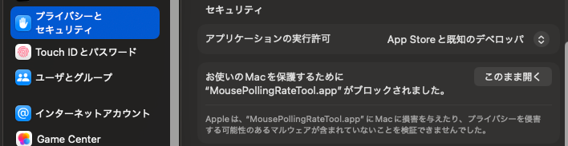
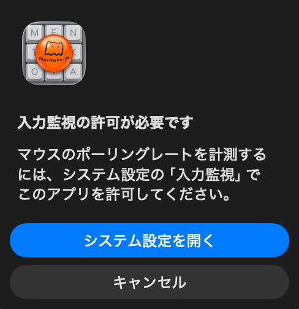
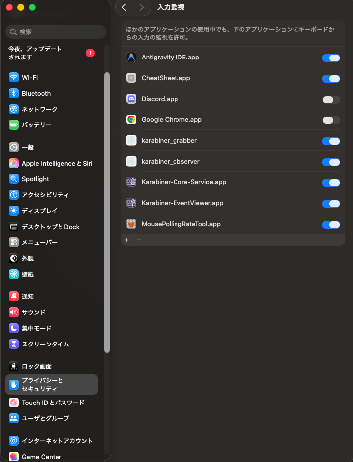

# MousePollingRateTool


マウスのポーリングレートを計測し、マウスカーソルの軌跡をリアルタイムで表示するmacOSアプリです。

## スクリーンショット



## 機能

- **ポーリングレート計測**：`IOHIDManager` を使用してマウスのX軸イベントを直接取得し、高精度にポーリングレート（Hz）を計測します
- **直近5秒間の統計表示**：直近5秒間の平均ポーリングレート（Average）および最大値（Maximum）をリアルタイムに集計・表示します
- **ポーリングレート推移グラフ**：0〜1200Hzスケール、最大30秒間の履歴を1秒刻みの折れ線グラフで可視化します。30秒を超過すると左端から古いデータが自動的にスクロールアウトします
- **ポインター停止検知**：マウス操作が停止した際は自動的に「ポインター停止中」状態となり、計測やグラフの更新を一時停止します
- **ウィンドウ全体の軌跡表示**：マウスカーソルの軌跡をウィンドウ全体に美しく描画します（透過オーバーレイ）

## 動作環境

- macOS 14.0 (Sonoma) 以降
- Apple Silicon / Intel Mac

## インストール

### ビルド済みDMGパッケージを使用する場合（推奨）

1. [**MousePollingRateTool.dmg をダウンロード**](https://github.com/mentako-ya/MousePollingRateTool/raw/main/MousePollingRateTool.dmg) します。
2. ダウンロードした `MousePollingRateTool.dmg` をダブルクリックして開きます。
3. 表示されたウィンドウで **MousePollingRateTool** を **Applications** フォルダにドラッグ＆ドロップしてください。

### 初回起動時のセキュリティ許可（Gatekeeperの解除）

本アプリはオープンソース（アドホック署名）のため、初回起動時に以下の警告が表示されて起動がブロックされる場合があります。



初回のみ、以下の手順でシステム設定から実行許可を行ってください。

1. 警告ダイアログの **「完了」** をクリックして閉じます。
2. **システム設定** → **プライバシーとセキュリティ** を開きます。
3. 画面下部（「セキュリティ」項目）に「**お使いのMacを保護するために“MousePollingRateTool.app”がブロックされました。**」と表示されるので、横の **「このまま開く」** をクリックします。



4. Macのログインパスワードまたは Touch ID で認証し、確認ダイアログで **「開く」** をクリックします。

---

### ソースからビルドする場合

1. Xcodeでプロジェクトを開きます

```bash
open MousePollingRateTool.xcodeproj
```

2. `⌘+R` でビルド・実行します

#### （オプション）DMGパッケージをビルドする

以下のスクリプトを実行すると、XcodeビルドからDMG生成までを自動で行い、ルートディレクトリに `MousePollingRateTool.dmg` が生成されます。

```bash
./scripts/build_dmg.sh
```

## 使い方

1. `/Applications/MousePollingRateTool.app` を起動します
2. 初回起動時、以下の「**入力監視の許可が必要です**」ダイアログが表示されたら、手順に従って権限を付与してください（詳細は下記「[必要な権限について](#必要な権限について入力監視の許可)」を参照）
3. マウスを動かすと自動的に計測が開始され、リアルタイムHz、5秒平均/最大値、推移グラフ、ウィンドウ全体の軌跡が更新されます
4. マウス操作を止めると「ポインター停止中」となり、グラフや統計情報の進行が一時停止します
5. 「Reset」ボタン（または `⌘+R`）で計測結果やグラフ履歴をリセットできます

## 必要な権限について（入力監視の許可）

このアプリはマウスの生のHIDイベントを取得するために、macOSの **入力監視（Input Monitoring / Listen Events）** の権限が必要です。

アプリを起動すると、以下のダイアログが表示されます。



### 許可の手順

1. ダイアログの **「システム設定を開く」** をクリックします（自動的に「システム設定」の「入力監視」画面が開きます）。
   - 手動で開く場合: **システム設定 → プライバシーとセキュリティ → 入力監視**
2. アプリ一覧から **MousePollingRateTool** を探し、トグルスイッチを **オン（有効）** に切り替えます。



3. Macのログインパスワードまたは Touch ID で認証を行います。
4. 「“MousePollingRateTool”を今すぐ終了して再度開きますか？」と表示された場合は、**「終了して再度開く」** をクリックします（表示されない場合は一度アプリを手動で終了し、再起動してください）。

> [!NOTE]
> すでにトグルがオンになっているにもかかわらずダイアログが表示される場合は、一度トグルを **オフ** にしてから再度 **オン** に切り替え、アプリを再起動してください。

## 技術仕様

### ポーリングレート計測

`IOHIDManager` を使用してマウスのX軸（`kHIDUsage_GD_X`）イベントを監視します。連続するイベント間の時間間隔の平均から1秒あたりのイベント数（Hz）を算出します。

### 軌跡の補完アルゴリズム

macOSの `NSEvent.mouseLocation` は画面のリフレッシュレート（60Hz等）でしか更新されません。そのため以下の方法で補完しています。

```
リフレッシュA: NSEvent座標Aを記録、X軸イベントカウントをリセット
              ↓
  X軸イベント × n回発生（IOHIDで検知、座標は使わない）
              ↓
リフレッシュB: NSEvent座標Bを取得
              A→B間をn等分（ratio = 1/n, 2/n, ..., n/n）
              → n点を等間隔に生成してtrailPointsに追加
              ↓
次サイクル: BをAとして繰り返す
```

X軸イベントの座標値は一切使用せず、**イベントの発生回数のみ**を補完の点数に使用します。

## ライセンス

MIT License
